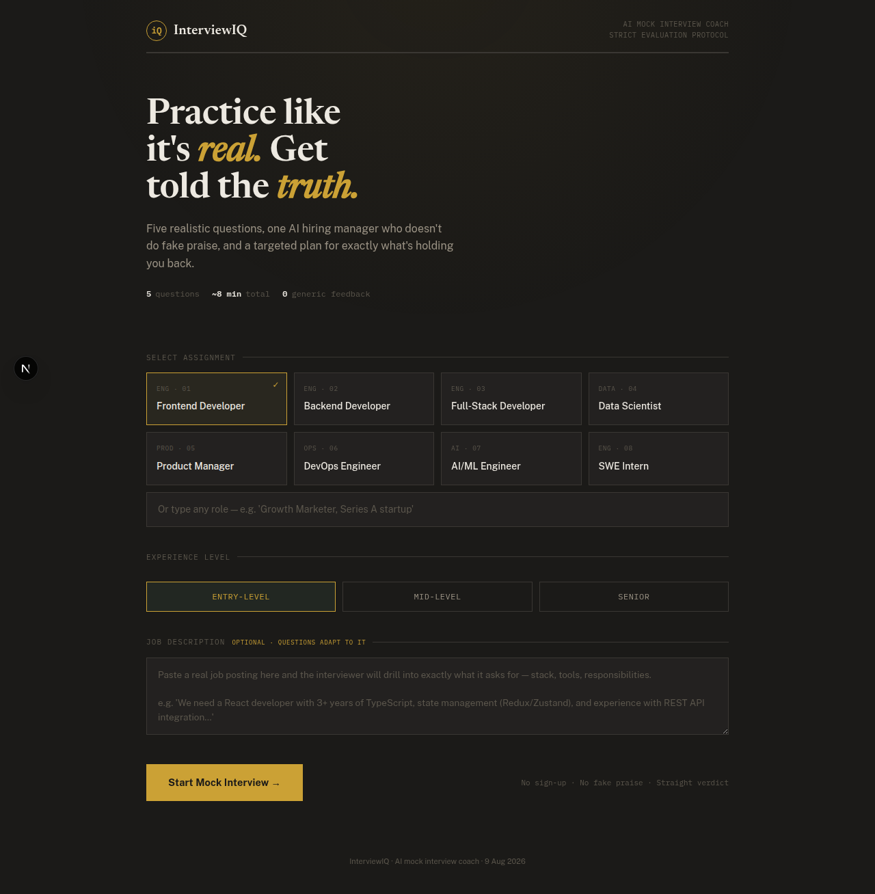
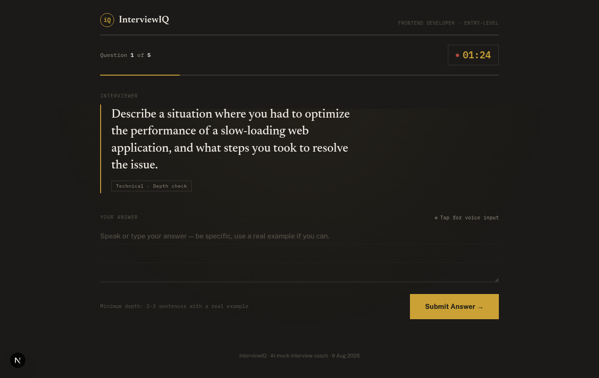
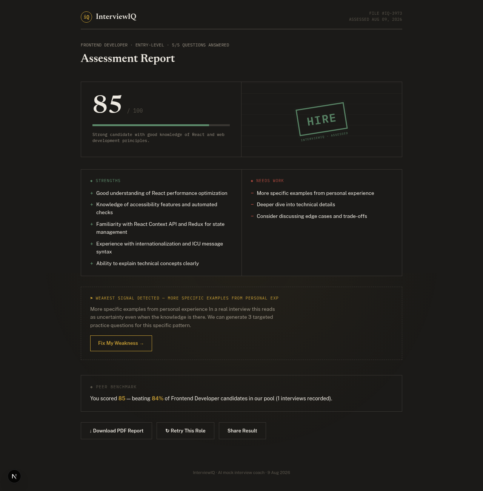

# 🎯 InterviewIQ — AI Mock Interview Coach

> **The AI interviewer that doesn't fake praise.** Practice real interviews for any role, get scored like a strict hiring manager, and walk away with a targeted plan to fix what's actually holding you back.
>
> Built for **Hack Devengers 1.0** (9 Aug 2026).

<div align="center">

**🔗 Live Demo: https://interviewiq-hazel.vercel.app**

</div>

---

## Screenshots

<div align="center">

**Setup — pick your role or paste a real job description**



**Live interview — real AI question with a 90s timer**



**Assessment report — strict verdict, scorecard, weakest signal, peer benchmark**



</div>

---

## The Problem

Most students and job seekers fail interviews not because they lack knowledge, but because they **never practice under realistic conditions**. Existing mock-interview tools are either paid, generic, or give no actionable feedback — they tell you "good job" without ever telling you what to fix.

**InterviewIQ solves this:** a free, instant, AI-powered mock interview that asks realistic role-specific questions, adapts to your experience level, scores you like a **strict hiring manager**, and generates a **targeted practice plan** for your weakest skills — all in under 10 minutes.

## Key Features

- 🎯 **Role-based interviews** — Frontend, Backend, Data Science, PM, DevOps, AI/ML, or any custom role
- 📊 **Adaptive difficulty** — Entry-level → Mid-level → Senior
- 📋 **Job-description targeting** — paste a real job posting and every question adapts to its exact stack, tools, and responsibilities; the final evaluation scores you against the JD's requirements
- 🤖 **Live AI interviewer** — one realistic question at a time, like a real interview
- 🔁 **Adaptive follow-ups** — vague or thin answers trigger a "tell me more" probe from the interviewer (up to 2 per question) instead of moving on, just like a real interviewer would
- ⚖️ **Strict, honest evaluation** — one-word answers score <30 / **No Hire**; detailed, example-backed answers score 80+ / Hire. No fake praise.
- 🚫 **Answer quality gate** — blocks lazy answers so every evaluation is fair
- 🎯 **Fix My Weakness** — AI detects your weakest skill and generates 3 targeted practice questions + a study tip
- 📋 **Structured report** — score (0–100), verdict, strengths, improvements, hiring recommendation
- 📱 **Fully responsive** — works on desktop and mobile
- 🖨 **Exportable report** — save or print your results
- 📊 **Peer benchmarking** — after your interview, see exactly what % of candidates you beat for your role, plus a live top-3 leaderboard. Share your result with the percentile — the ultimate "prove it" flex.
- 🔗 **Share Result** — one click copies your report summary with percentile to clipboard (or native share on mobile)

## Tech Stack

- **Next.js 16** (App Router, TypeScript, Tailwind CSS)
- **NVIDIA NIM API** — `meta/llama-3.1-8b-instruct` (fast, live AI, ~450ms)
- **Ollama fallback** — local CPU inference if no API key
- **Vercel** — instant global deployment

## How It Works

1. **Pick a role** — choose from 8 preset roles, or type any custom role + experience level
2. **Answer 5 questions** — a live AI interviewer asks realistic questions one at a time
3. **Get your report** — strict AI evaluation: score, verdict, strengths, improvements, hiring decision
4. **Fix your weakness** — one click generates a targeted practice plan for your weakest skill
5. **See where you stand** — your score joins a shared pool; the report shows your percentile vs. same-role candidates and a top-3 leaderboard (no signup, seeded baseline so early users never see 0%)

## Getting Started

```bash
npm install
cp .env.example .env.local   # add your NVIDIA_API_KEY
npm run dev
```

Open [http://localhost:3000](http://localhost:3000).

## Environment Variables

| Variable | Description |
|---|---|
| `NVIDIA_API_KEY` | NVIDIA NIM API key (free at build.nvidia.com) |
| `NVIDIA_MODEL` | Optional — default `meta/llama-3.1-8b-instruct` |
| `OLLAMA_URL` | Optional — local fallback, default `http://localhost:11434` |
| `OLLAMA_MODEL` | Optional — local fallback model, default `tinyllama` |
| `LEADERBOARD_URL` | Optional — Upstash Redis REST URL; defaults to the zero-config jsonblob store |

## API

`POST /api/interview` with `{ role, history, action }`:

| action | returns |
|---|---|
| `question` | next interview question |
| `evaluate` | `{ evaluation: { score, verdict, strengths, improvements, hiring } }` |
| `coach` | `{ plan: { skill, questions, tip } }` — targeted practice plan |

`GET /api/leaderboard?role=<role>&limit=3` — top candidates for a role.
`POST /api/leaderboard` with `{ role, level, score }` — record a result, returns percentile vs. peers.

## Live Demo

**🔗 https://interviewiq-hazel.vercel.app**

---

Built solo in 8 hours for Hack Devengers 1.0. Think. Build. Innovate.
